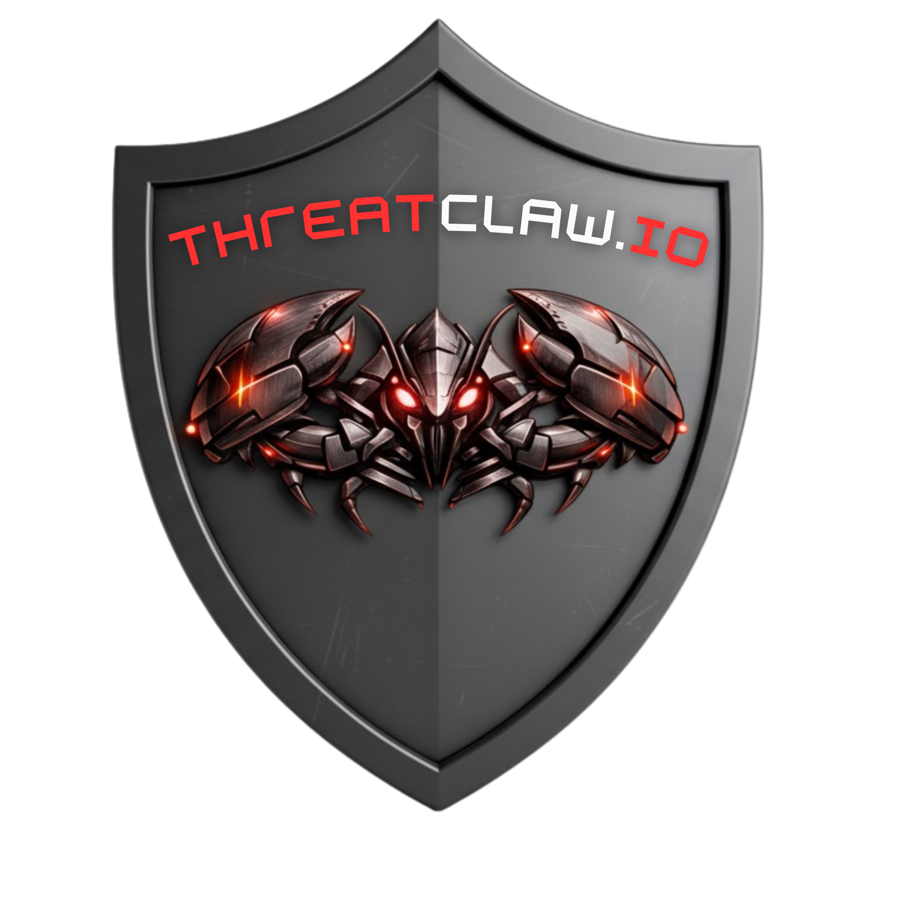

<h1 align="center">ThreatClaw</h1>
<p align="center">
  
</p>
<p align="center"><em>"They use AI to attack. We use AI to fight back."</em></p>
<p align="center"><strong>Autonomous cybersecurity agent for SMBs</strong></p>
<p align="center">Self-hosted · AI-powered · ML behavioral analysis · 100% on-premise</p>

<p align="center">
  
  
  
  
</p>

> **BETA** — ThreatClaw is in active development. Core features are functional and tested, but the product is not yet production-hardened.

---

## What is ThreatClaw?

ThreatClaw is a **self-hosted, AI-powered cybersecurity agent** that monitors, detects, correlates, and proposes remediations for security threats. It has been built for **autonomous SOC operations** targeting SMBs.

**All data stays on your infrastructure.** No cloud dependency required. No asset limits. Free and unlimited.

### 3 layers of detection

```
Layer 1 — Sigma Rules        → "I know this attack" (signatures)
Layer 2 — ML Isolation Forest → "This behavior is abnormal" (anomaly detection)
Layer 3 — LLM Analysis       → "Here's what's happening and what to do" (explanation)
```

## Quick Start

**One-line install (recommended):**
```bash
curl -fsSL https://get.threatclaw.io | sudo bash
```
This installs Docker (if needed), downloads all services, and starts ThreatClaw. Open `http://your-server:3001` to create your admin account.

**Docker Compose (manual):**
```bash
git clone https://github.com/threatclaw/threatclaw.git
cd threatclaw/docker
cp .env.example .env
docker compose up -d
```

**From source (developers):**
```bash
git clone https://github.com/threatclaw/threatclaw.git && cd threatclaw
cargo build --release
./target/release/threatclaw run
```

## Features

### 5-level AI Architecture
| Level | Name | Role |
|-------|------|------|
| L0 | ThreatClaw AI Ops | Conversational agent — talks to you, uses tool calling |
| L1 | ThreatClaw AI Triage | Pipeline — JSON classification, scoring |
| L2 | ThreatClaw AI Reasoning | Forensics — chain-of-thought, MITRE ATT&CK |
| L3 | ThreatClaw AI Instruct | Playbooks — SOAR, Sigma rules, reports |
| L4 | Cloud (optional) | Escalation — anonymized, Anthropic/Mistral/OpenAI |

### Core engine (Rust)
- **Intelligence Engine** — Runs every 5 min, collects alerts/findings, scores assets, decides notifications
- **Graph Intelligence** — Apache AGE (STIX 2.1): attack paths, lateral movement, campaigns, threat actors
- **Asset Management** — Auto-discovery, IP classification, MAC vendor lookup, fingerprinting
- **Dashboard Authentication** — Login, sessions (argon2id), brute force protection
- **Pause/Resume** — One-click to pause all services
- **9 notification channels** — Telegram, Slack, Discord, Mattermost, Ntfy, Gotify, Email, Signal, WhatsApp

### ML Engine (Python)
- **Isolation Forest** — Per-asset behavioral baseline (14 days), anomaly score 0-1
- **DGA Detection** — Random Forest on DNS domain names
- **DBSCAN Clustering** — Groups assets by behavior, detects outliers
- **Company Context** — Sector, business hours, geo scope adjust ML sensitivity

### Integrations (26 enrichments + 15 connectors)

**Enrichment (automatic, zero config):**
NVD, CISA KEV, EPSS, MITRE ATT&CK, CERT-FR, GreyNoise, CrowdSec, AbuseIPDB, Shodan, VirusTotal, HIBP, and 15 more.

**Connectors (plug your existing tools):**
Active Directory/LDAP, pfSense/OPNsense, Fortinet, Proxmox, GLPI, Wazuh, Nmap, Zeek, Suricata, Pi-hole, UniFi, and more.

### Dashboard (Next.js 14)
- Dark glass design, responsive, bilingual (FR/EN)
- Onboarding wizard
- Real-time security score, ML status, server health
- Skills marketplace (Connectors / Intelligence / Actions)
- Live system logs

### PDF Reports
- NIS2 (Early Warning 24h, Intermediate 72h, Final, Article 21)
- RGPD Article 33, ISO 27001, NIST SP 800-61r3
- Executive & Technical reports, Audit trail

## Pricing

**ThreatClaw is free and unlimited.** No asset limits. No feature gating.

Future premium skills will be available on the marketplace (hub.threatclaw.io).

## Architecture

```
Sources → PostgreSQL → ML Engine (5min) → Intelligence Engine → Graph AGE → LLM → User
                            ↑                       ↑
                    Isolation Forest          Asset correlation
                    DGA Detection            IP classification
                    DBSCAN Clustering        Fingerprinting
```

**Stack:** Rust (backend) · PostgreSQL + Apache AGE + pgvector (DB) · Python (ML) · Next.js 14 (dashboard) · Ollama (local LLM)

## Documentation

- [Getting Started](docs/getting-started.md) — Installation and first steps
- [Configuration](docs/configuration.md) — All settings and options
- [API Reference](docs/api.md) — REST API endpoints
- [Skill Development](docs/SKILL_DEVELOPMENT_GUIDE.md) — Build custom skills
- [Security Policy](SECURITY.md) — Vulnerability reporting
- [Contributing](CONTRIBUTING.md) — How to contribute
- [Changelog](CHANGELOG.md) — Version history

## Support ThreatClaw

ThreatClaw is and will remain open source. If this project is useful to you:

[](https://github.com/sponsors/0xyli)

## License

**AGPL v3 + Commercial dual-license.**

- Install on your own servers ✅
- Monitor your own infrastructure ✅
- Modify for your own use ✅
- MSSP deploying for clients ✅ (with commercial license)

> 99% of users are not affected by AGPL restrictions.

- Open source: [AGPL-3.0-or-later](LICENSE)
- Commercial: [Commercial License](LICENSE-COMMERCIAL.md) — contact commercial@threatclaw.io

---

Built by [CyberConsulting.fr](https://cyberconsulting.fr) — Cybersecurity consulting for SMBs
