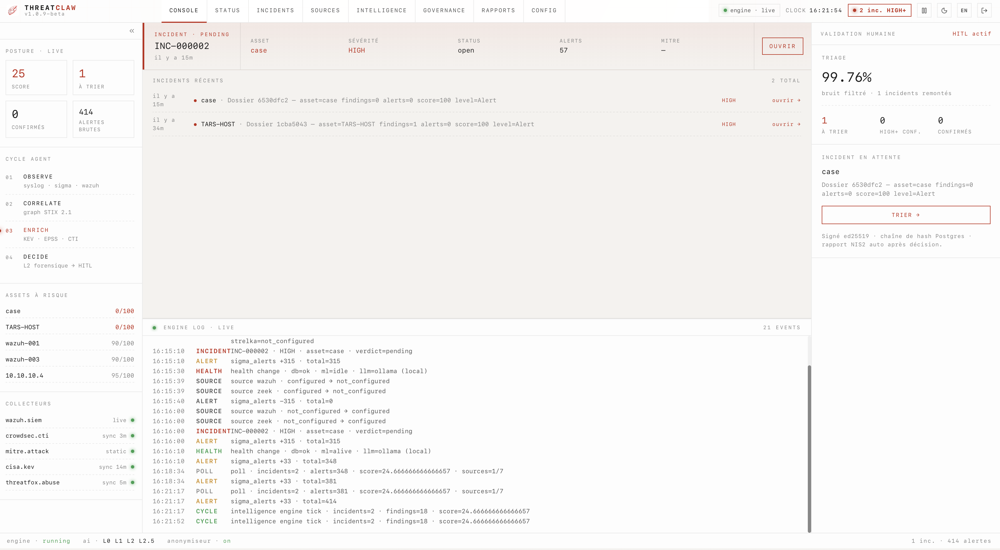
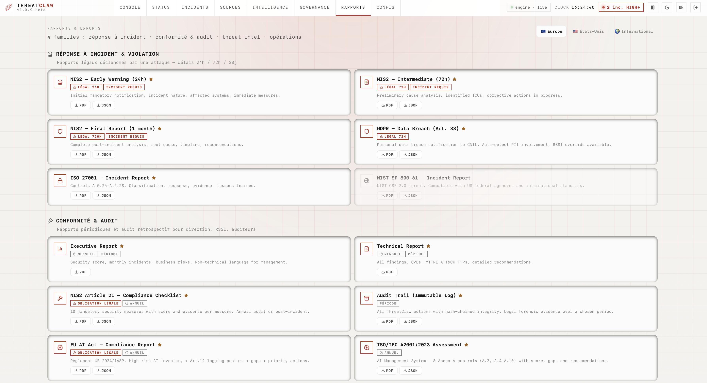

<h1 align="center">ThreatClaw</h1>
<p align="center">
  
</p>
<p align="center"><em>"They use AI to attack. We use AI to fight back."</em></p>
<p align="center"><strong>Autonomous cybersecurity agent for SMBs</strong></p>
<p align="center">Self-hosted · AI-powered · Behavioral Intelligence · HITL remediation · 100% on-premise</p>

<p align="center">
  
  <a href="LICENSE"></a>
  
  
</p>

<p align="center">
  <a href="https://cla-assistant.io/threatclaw/threatclaw"></a>
  <a href="CODE_OF_CONDUCT.md"></a>
  <a href="SECURITY.md"></a>
  <a href="CONTRIBUTING.md"></a>
</p>

> **BETA** — ThreatClaw is in active development. Core features are functional and tested, but the product is not yet production-hardened.

---

## What is ThreatClaw?

ThreatClaw is a **self-hosted, AI-powered cybersecurity agent** that monitors, detects, correlates, and proposes remediations for security threats. It has been built for **autonomous SOC operations** targeting SMBs.

**All data stays on your infrastructure.** No cloud dependency required. Self-hosted, AGPL v3 + Commercial dual-licensed.

### 4 layers of detection & response

```
Layer 1 — Signature-based    → "I know this attack"         (ClawMatch)
Layer 2 — Network analysis   → "This traffic is suspicious" (ClawTrace)
Layer 3 — Behavioral          → "This behavior is abnormal" (peer analysis, anomaly scoring)
Layer 4 — AI reasoning       → "Here's what to do about it" (ClawMind + HITL response)
```

## Quick Start

**One-line install (recommended):**
```bash
curl -fsSL https://get.threatclaw.io | sudo bash
```

No `curl`? Use `wget` instead:
```bash
wget -qO- https://get.threatclaw.io | sudo bash
```

This installs Docker (if needed), downloads all services, and starts ThreatClaw behind an HTTPS reverse proxy. Open `https://your-server` to create your admin account.

> **Prerequisites** — Debian 12+ / Ubuntu 22.04+ / RHEL 9+, 16 GB RAM minimum (32 GB recommended), 40 GB free disk, `curl` or `wget`, `sudo`. Fresh minimal installs of Debian may not ship `curl` by default — use the `wget` variant above, or `apt-get install -y curl` first.

**Docker Compose (manual):**
```bash
git clone https://github.com/threatclaw/threatclaw.git
cd threatclaw/docker
cp .env.example .env
docker compose up -d
```

**From source (developers):**
```bash
git clone https://github.com/threatclaw/threatclaw.git && cd threatclaw
cargo build --release
./target/release/threatclaw run
```

## Screenshots

<p align="center">
  
  <br><em>Dashboard — Real-time SOC Center</em>
</p>

<p align="center">
  
  <br><em>Graph Intelligence — STIX 2.1 attack graph, threat actors (APT attribution), lateral movement detection</em>
</p>

<p align="center">
  
  <br><em>Reports & Exports — NIS2, RGPD/CNIL, ISO 27001, NIST, STIX 2.1, MISP (PDF + JSON)</em>
</p>

## Features

### Multi-level AI Architecture
ThreatClaw uses a multi-level AI system that keeps 95% of decisions local and private. Cloud escalation is optional, always anonymized.

### Core engine (Rust)
- **Intelligence Engine** — Automated threat correlation and scoring
- **Incidents** — Synthesized view with AI verdict, HITL buttons, remediation tracking
- **Graph Intelligence** — STIX 2.1 attack graph: attack paths, lateral movement, campaigns
- **Asset Management** — Auto-discovery, classification, fingerprinting
- **Dashboard Authentication** — Login, sessions, brute force protection
- **Multi-channel notifications** — Telegram, Slack, Discord, Signal, WhatsApp, email, webhook

### ClawSuite — Detection & Response
- **ClawMatch** — Real-time IoC matching across millions of indicators
- **ClawTrace** — Network threat detection (TLS fingerprints, C2 beacons, certificate anomalies)
- **ClawMind** — Autonomous AI reasoning on confirmed threats
- **ClawResponse** — Guarded incident response (block IP, disable account, create ticket) with HITL
- **ClawShield** — Multi-layer protection preventing unauthorized remediation
- **ClawVault** — Encrypted credential storage for all integrations

### Behavioral Intelligence
- **Per-asset anomaly detection** — Continuous baseline learning per host
- **Peer Analysis** — Behavioral grouping, outlier detection ("the black sheep")
- **DNS Threat Analyzer** — Malicious domain detection (C2, DGA patterns)
- **Company Context** — Sector, business hours, geo scope adjust sensitivity

### Integrations

**Threat Intelligence (automatic, zero config):**
CISA KEV, EPSS, MITRE ATT&CK, CERT-FR, GreyNoise, CrowdSec, AbuseIPDB, Shodan, VirusTotal, HIBP, OpenPhish, ThreatFox, URLhaus, MalwareBazaar, MISP, OTX, SSL Labs, Mozilla Observatory, and more.

**Connectors (plug your existing tools):**
Active Directory/LDAP, pfSense/OPNsense, Fortinet, Proxmox, GLPI, Wazuh, Nmap, Zeek, Suricata, Pi-hole, UniFi, Cloudflare, and more.

**Remediation connectors:**
Firewall block, account disable, ticket creation — all gated by ClawShield HITL.

### Incident Workflow (HITL)
- **Synthesized incidents** — Raw alerts are correlated into actionable incidents with AI verdict
- **Interactive HITL** — Approve/reject remediation via Telegram, Slack, Discord, Signal, WhatsApp, or dashboard
- **Bidirectional sync** — Response on any channel updates the dashboard in real-time
- **Conversational bot** — Ask ThreatClaw in natural language ("status", "scan server-01", "block IP")
- **Audit trail** — Every HITL decision logged (who approved, when, from where)

### Dashboard (Next.js 14)
- Dark glass design, responsive, bilingual (FR/EN)
- Onboarding wizard
- Real-time security score, ML status, server health
- Incidents page with filters, HITL buttons, MITRE ATT&CK badges
- Skills marketplace (Connectors / Intelligence / Actions)
- Live system logs

### PDF Reports
- NIS2 (Early Warning 24h, Intermediate 72h, Final, Article 21)
- RGPD Article 33, ISO 27001, NIST SP 800-61r3
- Executive & Technical reports, Audit trail

## Pricing

ThreatClaw is **open source under AGPL v3** and free to self-host for evaluation, lab, and small environments.

For production use, paid tiers cover larger asset counts, support, and the commercial license:

| Tier | Billable assets | Commitment |
|---|---|---|
| **Free** | up to 50 | self-hosted, AGPL v3, community support |
| **Starter** | up to 200 | monthly or annual |
| **Pro** | up to 500 | monthly or annual |
| **Business** | up to 1500 | monthly or annual |
| **Enterprise** | unlimited / MSP | contact us |

HITL remediation (firewall block, account disable, ticket creation, …) is **included on every tier**. See [threatclaw.io/pricing](https://threatclaw.io/pricing) for current rates and the asset-counting rules.

## Architecture

```
       Sources (syslog, webhooks, connectors)
              │
              ▼
       ClawMatch + ClawTrace        (real-time detection)
              │
              ▼
       Behavioral Intelligence      (ML anomalies, peer analysis)
              │
              ▼
       Intelligence Engine          (correlation, scoring)
              │
              ▼
       ClawMind                     (AI investigation on threats)
              │
              ▼
       Incidents                    (synthesized view)
              │
              ▼
       ClawResponse + ClawShield    (HITL remediation, protected)
              │
              ▼
       Channels (Telegram/Slack/Dashboard)
```

**Stack:** Rust (backend) · PostgreSQL (DB) · Python (ML) · Next.js 14 (dashboard) · Local LLM

## Documentation

- [Getting Started](docs/getting-started.md) — Installation and first steps
- [Configuration](docs/configuration.md) — All settings and options
- [API Reference](docs/api.md) — REST API endpoints
- [Skill Development](docs/SKILL_DEVELOPMENT_GUIDE.md) — Build custom skills
- [Telemetry](docs/telemetry.md) — What we collect anonymously, how to opt out
- [Security Policy](SECURITY.md) — Vulnerability reporting
- [Contributing](CONTRIBUTING.md) — How to contribute
- [Changelog](CHANGELOG.md) — Version history

## Community & Support

| Need | Where to go |
|------|-------------|
| Bug report | [GitHub Issues](https://github.com/threatclaw/threatclaw/issues/new?template=bug_report.yml) |
| Feature request | [GitHub Issues](https://github.com/threatclaw/threatclaw/issues/new?template=feature_request.yml) |
| Question / Support | [GitHub Discussions](https://github.com/threatclaw/threatclaw/discussions) |
| Security vulnerability | [Security Advisories](https://github.com/threatclaw/threatclaw/security/advisories) (private) |
| Commercial / Licensing | [contact@threatclaw.io](mailto:contact@threatclaw.io) |

## Support ThreatClaw

ThreatClaw is and will remain open source. If this project is useful to you:

[](https://github.com/sponsors/0xyli)

## License

**AGPL v3 + Commercial dual-license.**

- Install on your own servers — yes
- Monitor your own infrastructure — yes
- Modify for your own use — yes
- MSSP deploying for clients — yes, with commercial license

> 99% of users are not affected by AGPL restrictions.

- Open source: [AGPL-3.0-or-later](LICENSE)
- Commercial: [Commercial License](LICENSE-COMMERCIAL.md) — contact commercial@threatclaw.io

---

Built by [CyberConsulting.fr](https://cyberconsulting.fr) — Cybersecurity consulting for SMBs
